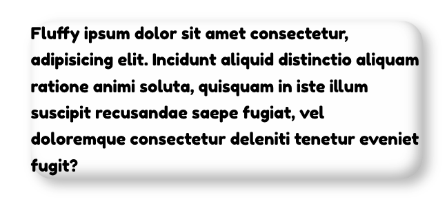
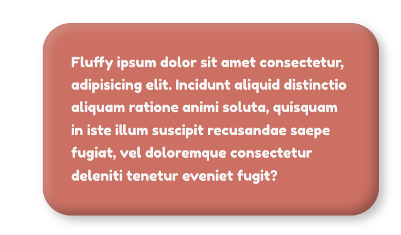

# clay.css

Extensible and configurable micro CSS util class and SASS mixin for adding claymorphism styles to your components.


## About

Claymorphism is a fresh new concept. The name was coined by [Michał Malewicz](https://hype4.academy/articles/design/claymorphism-in-user-interfaces) and the designers are excited to explore the possibilities of this approach to UI design.

It features inflated fluffy 3D elements which look charming and introduce a much more vibrant look compared to the usual flat designs.

What sets claymorphism apart from neumorphism is that it floats above the background instead of being connected to it, eliminating accessibility issues and design restrictions of the latter.

## Installation
### CDN

```
<link
  rel="stylesheet"
  href="https://unpkg.com/claymorphism-css/dist/clay.css"
/>
```

### NPM

```
npm i claymorphism-css
```

```
yarn add claymorphism-css
```

### Manual

Download and add the `dist/clay.css` or `dist/clay.scss` manually.

## Usage

This is a minimal, single class CSS util that applies only basic claymorphism styles:
* Background
* Border radius
* One outset shadow
* Two inset shadows

```html
<div class="clay">
  Fluffy ipsum dolor sit amet consectetur...
</div>
```



This CSS class allows you to easily change the claymorphic styles via CSS properies. These changes and additional styles should be applied with the extending class.

```html
<div class="clay card">
  Fluffy ipsum dolor sit amet consectetur...
</div>
```

```css
.card{
  /* Modify clay.css properties */
  --clay-background: #f76d6d;
  --clay-border-radius: 48px;

  /* Extended styles */
  color: #f1f1f1;
  padding: 48px;
}
```




## Options (CSS Variables)

```
--clay-background
--clay-border-radius
--clay-shadow-outset
--clay-shadow-inset-primary
--clay-shadow-inset-secondary
```


## SASS Mixin

SASS mixin allows you more flexibility in applying claymorphism styles to your components. For example, this way you can easily add styles to pseudo-elements or pseudo-selectors or use the mixin in other SASS mixins or functions.

```
@import "claymorphism-css/dist/clay.scss";

@import @include clay(
  $background: [value],
  $border-radius: [value],
  $shadow-outset: [value],
  $shadow-inset-primary: [value],
  $shadow-inset-secondary: [value]
);
```


## FAQ

### How do I apply claymorphism styles to pseudo-elements or pseudo-selectors?

If you are using SASS, you can easily do it with the mixin. See the example above.

If you are using vanilla CSS and a util class, you cannot apply it to pseudo-elements and pseudo-selectors.

You'll have to apply the following styles manually. Check out the default values provided by the `clay` class.

```css
  background: [value];
  border-radius: [value];
  box-shadow: [value];
```


### Why not build the entire framework / design system?

This is a relatively new and unexplored concept, so I didn't want to build an entire design system or a CSS framework that enforces styles on buttons. inputs, nav, cards and other elements, etc. and end up with accessibility issues and a framework that is hard to maintain.

I wanted to leave it unopinionated and simple, so its easily customizable and can be sprinkled throughout your project. This approach allows you full control over the styles and how you adapt them to your design.

I've built a [demo page](https://codeadrian.github.io/clay.css/) and it was really fun, useful and intuitive. CSS variables are easy to memorize and easily customizable.

## Sponsors

If you enjoy using clay.css, please consider supporting the development of the project. Your name and link will appear here.

[Become a sponsor!](https://www.buymeacoffee.com/ubnZ8GgDJ/e/52580)